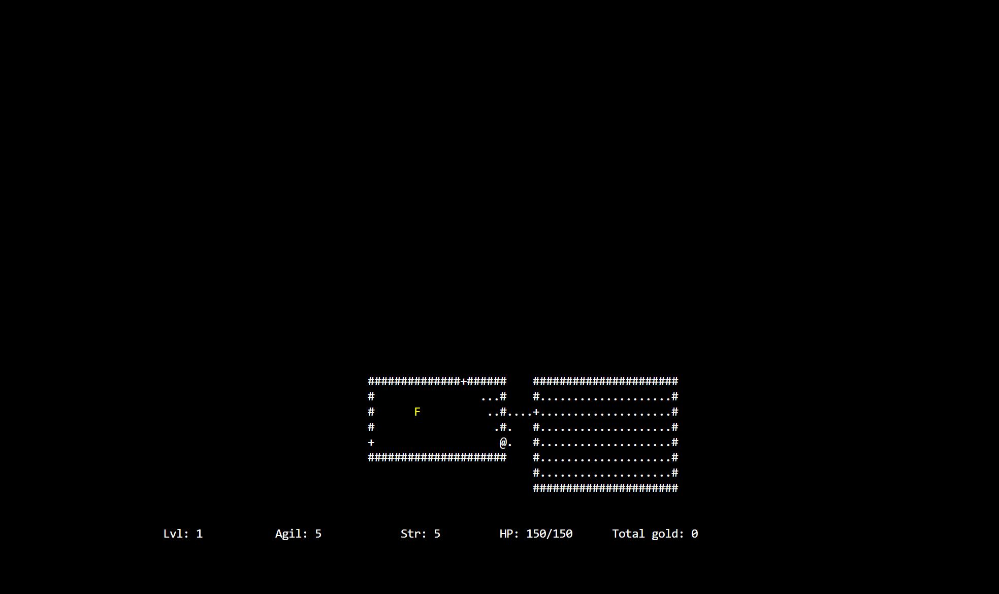
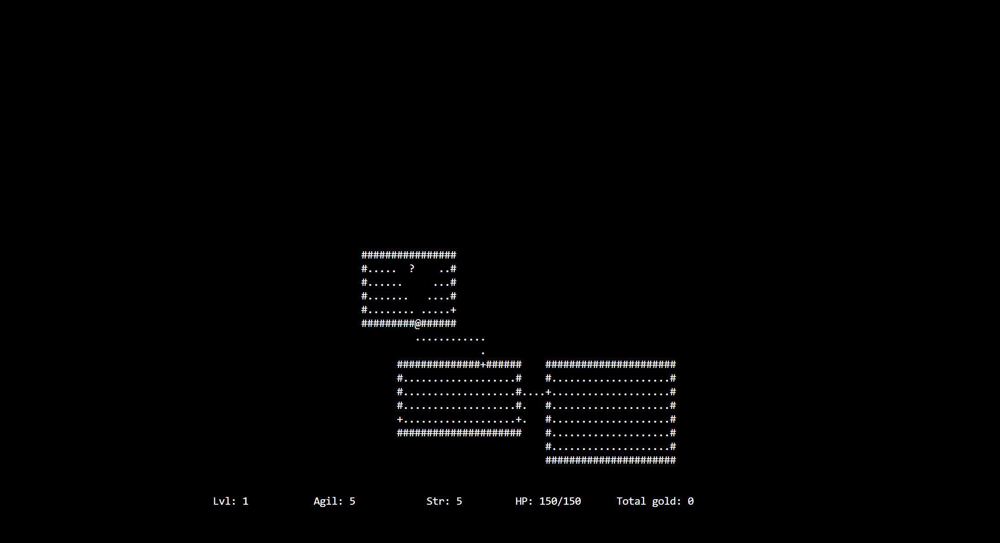
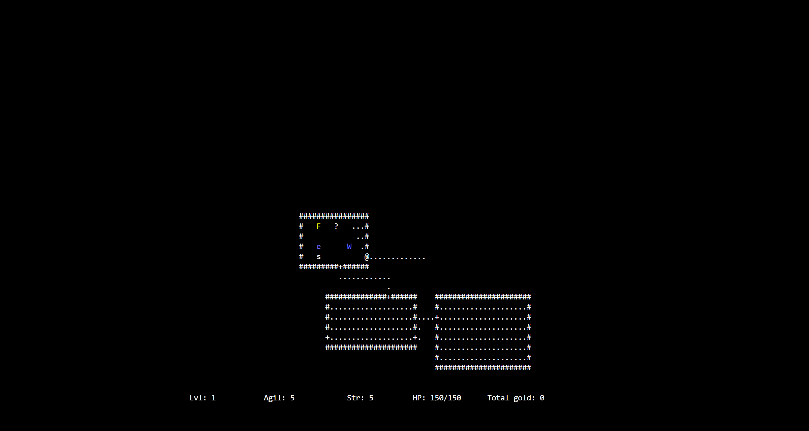
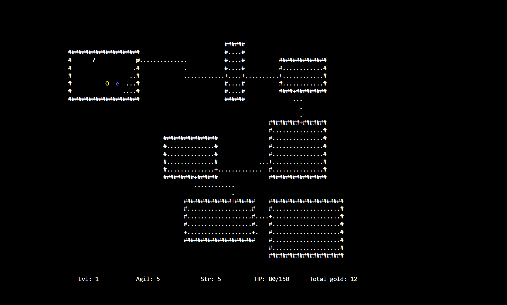
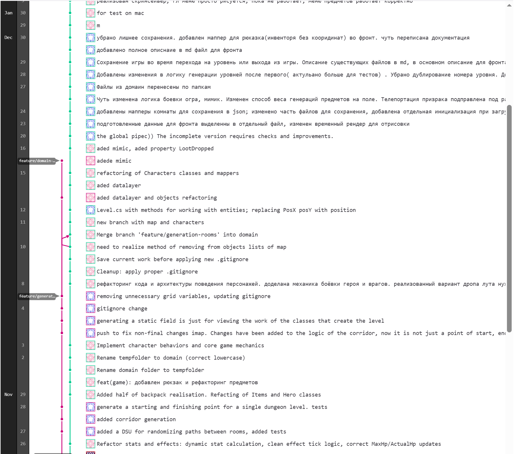

# Rogue-like Console Game (C#)




## Описание проекта

Консольная кроссплатформенная игра в жанре *rogue-like*, реализованная на **C#** с использованием библиотеки **dotnet-curses**. Проект вдохновлён классической игрой *Rogue (1980)* и реализует процедурную генерацию подземелий, пошаговый геймплей и систему прогрессии игрока.

Проект является **групповым**, реализованные мной части выделены ниже.

---

### Генерация уровней
- Процедурная генерация подземелий (21 уровень)
- Каждый уровень:
  - состоит из 9 комнат
  - соединён коридорами (гарантированная связность графа)
- Реализовано:
  - генерация комнат, коридоров, стен и дверей
  - стартовая и конечная точки уровня
  - проверка связности графа
  - использование **DSU (Disjoint Set Union)** для рандомизации путей

---

### Архитектура
Проект построен с чётким разделением слоёв:
- **Domain** — игровая логика и сущности
- **Presentation** — рендеринг (CLI через curses)
- **DataLayer** — сохранение и загрузка
---

### Геймплей
- Пошаговая система (ход игрока → ход врагов)
- Перемещение, бой, взаимодействие с предметами
- Система уровней с усложнением:
  - больше врагов
  - меньше полезных предметов
  - больше наград

---

### Боевая система
- Формулы урона:
  - расчёт попадания (на основе ловкости)
  - расчёт урона (с учётом силы и оружия)
- Сделана:
  - логика нанесения урона
  - баффы HP
  - поведение врагов
---

### Предметы и инвентарь
- Добавлен маппер для передачи инвентаря во frontend

---

### Сохранение и загрузка
- Сохранение:
  - при выходе из игры
  - при переходе между уровнями
  - результатов игры для статистики
- Используется JSON
- Реализовано:
  - мапперы для комнат и сущностей
  - восстановление полной игровой сессии
  - отдельная инициализация:
    - новой игры
    - загрузки из файла
---

### Рендеринг
- Реализован:
  - **туман войны**
  - отображение коридоров с fog-of-war
  - отрисовка после загрузки

---

## Технические детали

- Язык: **C# 12**
- Интерфейс: **dotnet-curses**
- Архитектура: **слоистая (Domain / Presentation / DataLayer)**
- Хранение данных: **JSON**
- Подход:
  - процедурная генерация
  - пошаговая логика
---

## Запуск

```bash
dotnet build
dotnet run
```
## Граф коммитов

